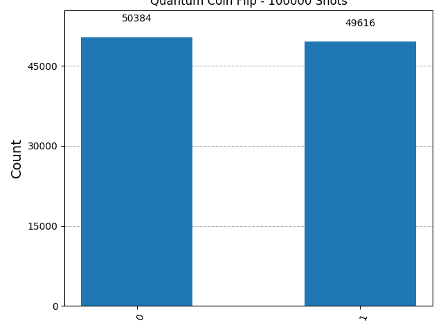

# Quantum Coin Flipper

A quantum coin flip simulation using Qiskit that demonstrates superposition and state measurement.

## Features

- Single-qubit quantum coin flip simulation
- Uses a Hadamard gate to create superposition
- Configurable number of measurement shots
- Histogram visualization of results
- Implemented using Qiskit primitives

## To run:
```
git clone https://github.com/tanaydubey54/quantum-coin-flipper.git
cd quantum-coin-flipper
pip install -r requirements.txt
python coinflip.py
```
After launching the program, enter the desired number of measurement shots when prompted.

## Output:
The program:
- simulates repetitive measurement of a qubit in equal superposition
- displays measurement counts for the states  |0⟩ and |1⟩
- generates and saves a histogram as `histogram.png` showing roughly equal counts for |0⟩ and |1⟩.

### Sample Output:
```
Enter number of shots: 100000
Results: {'0': 50384, '1': 49616}
```


In the histogram in the repo the counts are 50384 and 49616 respectively for 100000 shots ran in the program. These numbers approach 50000 each as the number of shots ran increases (50/50 chance).

## Files:
- `coinflip.py` - main simulation script
- `histogram.png` - output histogram from the last run
- `requirements.txt` - dependencies
- `CHANGELOG.md` - change log

## Simulation Instead of Hardware
This project uses Qiskit's StatevectorSampler primitive to simulate quantum measurements on a single-qubit circuit. No quantum hardware is required.

## Requirements:
- Python 3.12+
- Qiskit 2.4.1
- matplotlib

## Project Structure:
quantum-coin-flipper/<br>
├── CHANGELOG.md<br>
├── README.md<br>
├── coinflip.py<br>
├── histogram.png<br>
└── requirements.txt<br>


## Concepts Demonstrated
- Qubit initialization
- Quantum superposition
- Hadamard gate
- Quantum measurement
- Born rule
- Statevector simulation
- Qiskit circuit construction

## How it Works
A single qubit quantum circuit is initialized with the qubit in the state |0⟩ by default : `qc = QuantumCircuit(1)`

On the qubit, the Hadamard Gate is applied, putting the qubit into an equal superposition of |0⟩ and |1⟩ : `qc.h(0)`

When measured, the qubit collapses to either state with equal probabilities - a 50/50 chance - the quantum equivalent of flipping a fair coin.

## Circuit Diagram: 
q: ──H──M──


## The Hadamard Gate
The Hadamard gate is a fundamental quantum logic gate that takes a definite classical state (like (0) or (1)) and transforms it into a "superposition" state. When applied, it gives the qubit an equal probability of being measured as (0) or (1).
```math
H = \frac{1}{\sqrt{2}}\begin{bmatrix} 1 & 1 \\ 1 & -1 \end{bmatrix}
```

H|0⟩: If the input is |0⟩, it outputs:

$$\frac{|0\rangle + |1\rangle}{\sqrt{2}}$$

H|1⟩: If the input is |1⟩, it outputs:

$$\frac{|0\rangle - |1\rangle}{\sqrt{2}}$$

Thus, it takes a definite state and puts it into equal superposition. Measuring the output gives 0 or 1 with exactly 50% probability each:
- When measuring a qubit, the probability of getting a particular outcome is the square of its amplitude. This is known as the Born rule - it's the fundamental rule in quantum mechanics that connects the mathematics of amplitudes to the physical reality of measurement probabilities.
- For H|0⟩: P(0) = (1/√2)² = 1/2 = 50%<br>&emsp;&emsp;&emsp;&emsp;P(1) = (1/√2)² = 1/2 = 50%
- and for H|1⟩: P(0) = (1/√2)² = 1/2 = 50%<br>&emsp;&emsp;&emsp;&emsp;&emsp;&emsp;P(0) = (-1/√2)² = 1/2 = 50%

The Hadamard gate is also its own inverse - if it is applied to the same qubit twice it reverses the transformation and restores the qubit to its original state.
